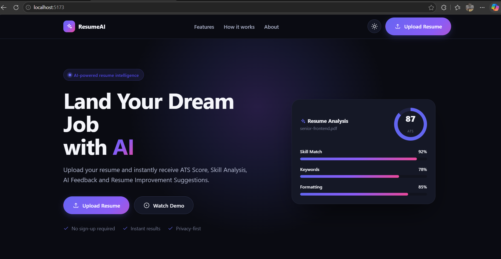
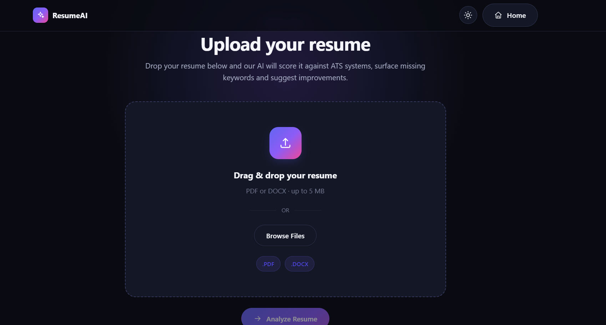
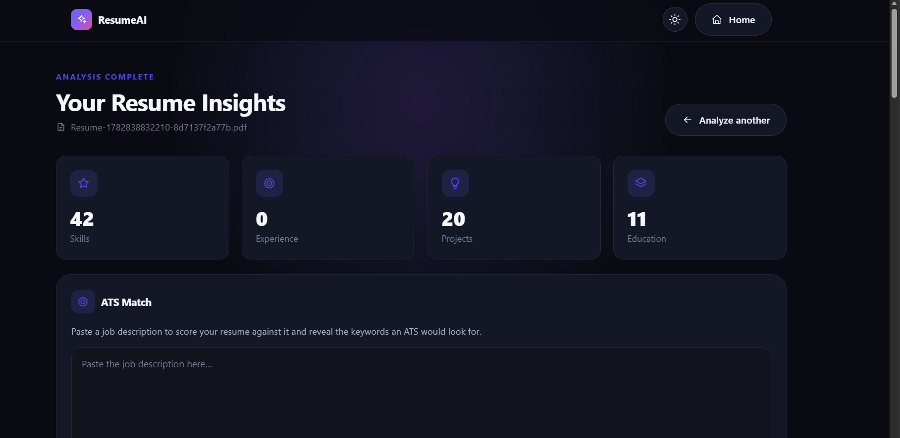
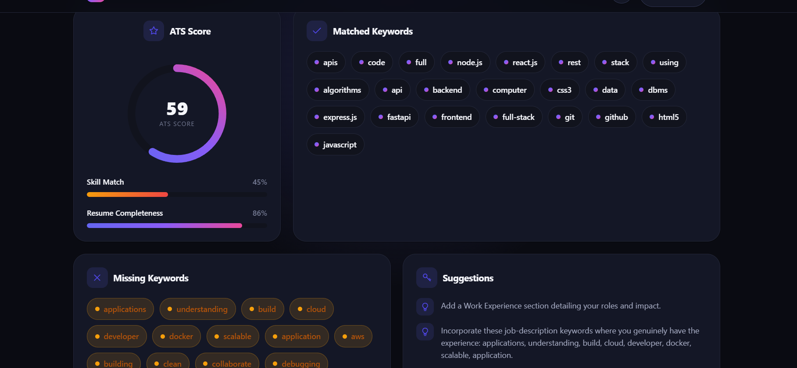

# AI Resume Analyzer

> Upload a resume, parse it into structured data, and score it against any job description with a built-in **ATS (Applicant Tracking System) engine** — no external LLM APIs required.

AI Resume Analyzer is a full-stack application that turns a raw resume PDF into actionable insights. A Python microservice extracts structured data on-device, an Express backend orchestrates uploads and runs the ATS scoring engine, and a modern React dashboard visualizes the results.

<p align="center">
  
  
  
  
  
</p>

---

## Table of Contents

- [Features](#features)
- [Tech Stack](#tech-stack)
- [Architecture](#architecture)
- [Screenshots](#screenshots)
- [Installation](#installation)
- [Project Structure](#project-structure)
- [API Endpoints](#api-endpoints)
- [Environment Variables](#environment-variables)
- [Future Improvements](#future-improvements)
- [License](#license)

---

## Features

- **PDF Resume Parsing** — Extracts contact details, skills, education, experience, and projects from a resume PDF using PyMuPDF + spaCy + regex (fully on-device, no LLM API calls).
- **ATS Scoring Engine** — Compares the parsed resume against a job description and computes a real **0–100 ATS score**.
- **Skill Match %** — Measures how many job-description keywords are explicitly backed by your resume's skills.
- **Matched & Missing Keywords** — Surfaces exactly which job keywords you hit and which gaps to close.
- **Resume Completeness** — Flags missing standard sections (name, email, phone, skills, education, experience, projects).
- **Actionable Suggestions** — Generates human-readable tips to improve your match before applying.
- **Modern Dashboard** — Animated circular score ring, progress bars, keyword tags, and a clean light/dark themeable UI.
- **Resilient by Design** — Clean error handling across services, best-effort MongoDB persistence, and graceful empty states.

---

## Tech Stack

### Frontend
- **React 19** + **Vite 8**
- **React Router 7** for routing
- **Axios** for API calls
- Hand-rolled CSS design system (no UI framework) with light/dark theming

### Backend (API + ATS Engine)
- **Node.js** + **Express 4**
- **Multer** for file uploads
- **Mongoose / MongoDB** for upload metadata (optional / best-effort)
- **Axios + form-data** to forward files to the parser
- **Helmet**, **CORS**, **Morgan** for security & logging

### Parser Microservice
- **Python 3.9+** + **FastAPI** + **Uvicorn**
- **PyMuPDF** for PDF text extraction
- **spaCy** (`en_core_web_sm`) for NLP / name detection
- **Pydantic** for schema validation

---

## Architecture

The system is split into three independently runnable services:

```
┌──────────────┐        ┌──────────────────────────┐        ┌───────────────────────┐
│   React UI   │  HTTP  │     Express Backend       │  HTTP  │  FastAPI Parser        │
│  (Vite :5173)│ ─────► │        (:5000)            │ ─────► │  Microservice (:8000)  │
│              │        │                           │        │                        │
│  • Upload    │        │  • POST /api/upload       │        │  • POST /parse         │
│  • Dashboard │ ◄───── │  • POST /api/ats/analyze  │ ◄───── │    (PyMuPDF + spaCy)   │
│  • JD input  │        │    (ATS scoring engine)   │        │                        │
└──────────────┘        └────────────┬──────────────┘        └───────────────────────┘
                                      │
                                      ▼
                               ┌─────────────┐
                               │   MongoDB   │  (upload metadata, best-effort)
                               └─────────────┘
```

**Request flow:**

1. The user uploads a resume PDF in the React app → `POST /api/upload`.
2. Express stores upload metadata (if MongoDB is available) and forwards the file to the Python parser's `POST /parse`.
3. The parser returns structured resume JSON, which Express relays back to the frontend dashboard.
4. On the dashboard, the user pastes a **job description** → `POST /api/ats/analyze`.
5. The Express **ATS engine** scores the parsed resume against the job description and returns the score, matched/missing keywords, completeness, and suggestions.

> The ATS engine (`backend/src/services/atsService.js`) is pure, dependency-free, and modular — keyword extraction, matching, skill match, completeness, scoring, and suggestions are each isolated, testable functions.

---

## Screenshots

> Replace these placeholders with real screenshots once captured.

| Landing Page | Upload Flow |
| --- | --- |
|  |  |

| Dashboard — Parsed Insights | ATS Match — Score & Keywords |
| --- | --- |
|  |  |

---

## Installation

### Prerequisites

- **Node.js** 18+ and npm
- **Python** 3.9+
- **MongoDB** (optional — the backend runs without it; upload metadata persistence is skipped if unavailable)

Clone the repository:

```bash
git clone https://github.com/<your-username>/AI-Resume-Analyzer.git
cd AI-Resume-Analyzer
```

You'll run **three** services. Open three terminals (one per service).

### 1. Python Parser Service

```bash
cd python-service

# Create & activate a virtual environment
python -m venv venv
# Windows (PowerShell)
venv\Scripts\Activate.ps1
# macOS / Linux
# source venv/bin/activate

pip install -r requirements.txt

# One-time: download the spaCy English model
python -m spacy download en_core_web_sm

# Run on http://localhost:8000
uvicorn app:app --reload --port 8000
```

### 2. Express Backend

```bash
cd backend

npm install

# Configure environment
cp .env.example .env   # Windows: copy .env.example .env

# Run on http://localhost:5000
npm run dev
```

### 3. React Frontend

```bash
cd frontend

npm install

# Run the Vite dev server on http://localhost:5173
npm run dev
```

Then open **http://localhost:5173** in your browser.

---

## Project Structure

```
AI-Resume-Analyzer/
│
├── frontend/                     # React + Vite client
│   └── src/
│       ├── pages/                # LandingPage, UploadResume, LoadingAnalysis, Dashboard
│       ├── components/           # Card, StatCard, CircularScore, ProgressBar, icons, ...
│       ├── lib/api.js            # Axios client (uploadResume, analyzeAts, getErrorMessage)
│       ├── hooks/                # useTheme
│       └── styles/               # Design-system CSS (global, ui, Dashboard, ...)
│
├── backend/                      # Express API + ATS engine
│   └── src/
│       ├── server.js             # HTTP server bootstrap
│       ├── app.js                # Express app, middleware, route mounting
│       ├── config/               # env.js, db.js
│       ├── controllers/          # healthController, uploadController, atsController
│       ├── services/             # uploadService, parserService, atsService  ← ATS engine
│       ├── routes/               # health, upload, ats route definitions
│       ├── middleware/           # multer upload, ApiError, errorHandler, notFound
│       └── models/               # Upload (Mongoose schema)
│
└── python-service/               # FastAPI resume parser microservice
    ├── app.py                    # FastAPI app + POST /parse route
    ├── parser.py                 # Core extraction logic (PyMuPDF + spaCy + regex)
    ├── models.py                 # Pydantic schemas
    └── requirements.txt          # Pinned Python dependencies
```

---

## API Endpoints

### Express Backend (`http://localhost:5000`)

| Method | Endpoint            | Description                                                    |
| ------ | ------------------- | ------------------------------------------------------------- |
| `GET`  | `/api/health`       | Liveness probe → `{ "status": "ok" }`                         |
| `POST` | `/api/upload`       | Upload a resume PDF (multipart field `resume`); returns parsed resume JSON |
| `POST` | `/api/ats/analyze`  | Score a parsed resume against a job description (ATS engine)   |

**`POST /api/ats/analyze`**

Request body:

```json
{
  "resume": { "contact": { "...": "..." }, "skills": ["..."], "...": "..." },
  "jobDescription": "Backend engineer with Node.js, Express, PostgreSQL, Docker..."
}
```

Response:

```json
{
  "success": true,
  "atsScore": 72,
  "skillMatch": 60,
  "matchedKeywords": ["node.js", "express", "rest"],
  "missingKeywords": ["postgresql", "docker", "aws"],
  "resumeCompleteness": 86,
  "suggestions": ["Incorporate these job-description keywords: postgresql, docker, aws.", "..."]
}
```

### Python Parser Service (`http://localhost:8000`)

| Method | Endpoint   | Description                                                   |
| ------ | ---------- | ------------------------------------------------------------- |
| `GET`  | `/`        | Service metadata                                              |
| `GET`  | `/health`  | Liveness probe → `{ "status": "healthy" }`                    |
| `POST` | `/parse`   | Accept a PDF (multipart field `file`); return structured JSON |
| `GET`  | `/docs`    | Interactive Swagger UI                                        |

---

## Environment Variables

Backend (`backend/.env` — see `backend/.env.example`):

| Variable             | Default                                          | Description                                   |
| -------------------- | ------------------------------------------------ | --------------------------------------------- |
| `PORT`               | `5000`                                           | Port the Express server listens on            |
| `NODE_ENV`           | `development`                                    | `development` \| `production`                 |
| `MONGODB_URI`        | `mongodb://127.0.0.1:27017/ai-resume-analyzer`   | MongoDB connection string (optional)          |
| `CORS_ORIGIN`        | `http://localhost:5173`                          | Comma-separated allowed origins               |
| `MAX_UPLOAD_SIZE`    | `5242880` (5 MB)                                 | Max upload size in bytes                       |
| `UPLOAD_DIR`         | `src/uploads`                                    | Where uploaded files are stored                |
| `PARSER_SERVICE_URL` | `http://localhost:8000`                          | Base URL of the Python parser service          |
| `PARSER_TIMEOUT_MS`  | `30000`                                          | Timeout for parser requests (ms)               |

Frontend (`frontend/.env`, optional):

| Variable        | Default                  | Description                  |
| --------------- | ------------------------ | ---------------------------- |
| `VITE_API_URL`  | `http://localhost:5000`  | Base URL of the Express API  |

---

## Future Improvements

- **OCR support** for scanned / image-only PDFs (e.g. Tesseract).
- **DOCX parsing** in addition to PDF.
- **Semantic matching** using embeddings so synonyms and related skills count toward the score (not just exact keywords).
- **Multi-resume comparison** and history powered by the existing MongoDB layer.
- **Authentication & user accounts** to save analyses over time.
- **Exportable reports** (PDF/JSON) of the ATS analysis.
- **Unit & integration test suites** across all three services + CI pipeline.
- **Dockerized deployment** with `docker-compose` for one-command startup.
- **Configurable scoring weights** and an extensible skills dictionary via the UI.

---

## License

This project is licensed under the **MIT License**.
